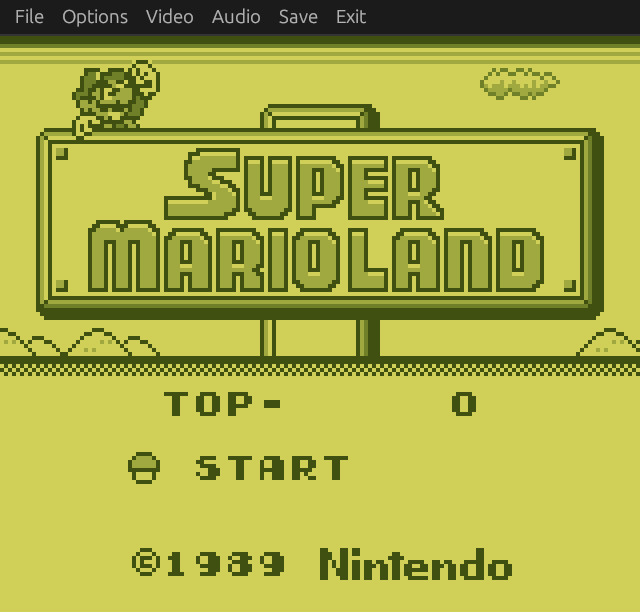
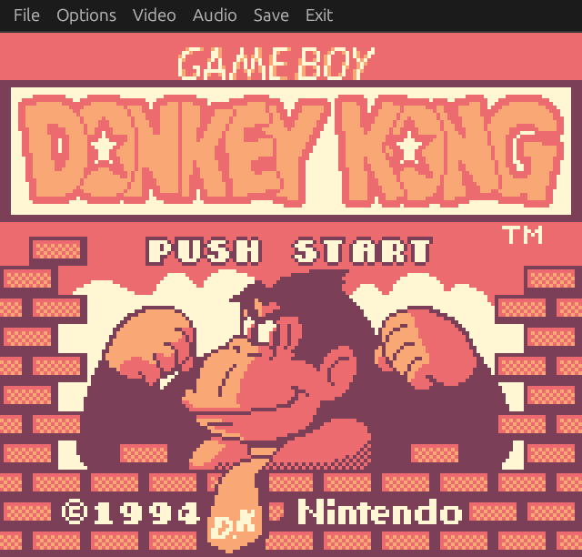
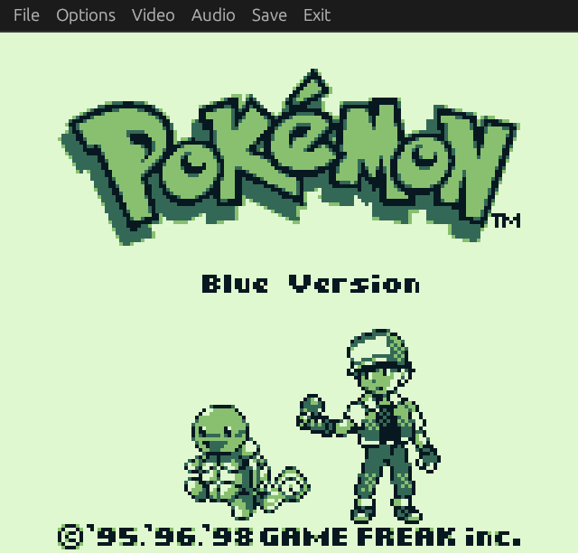
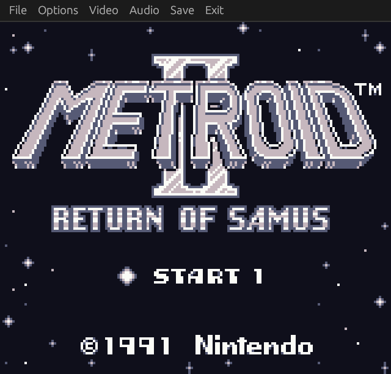
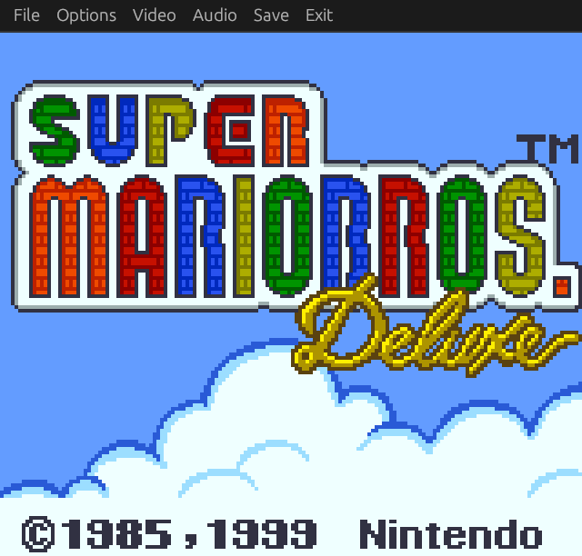
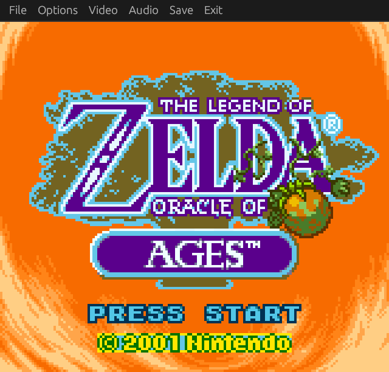
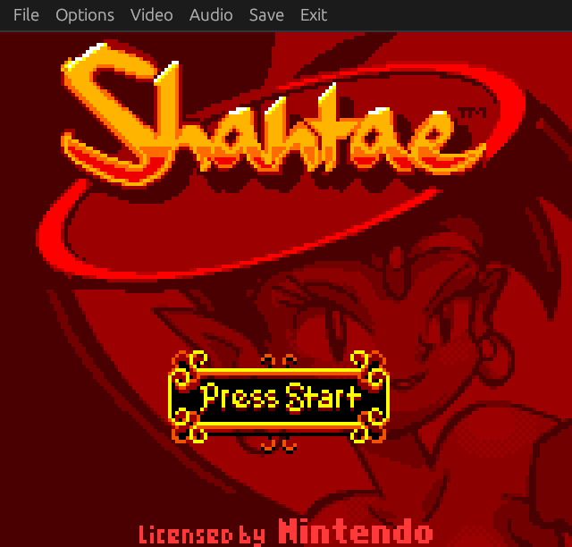
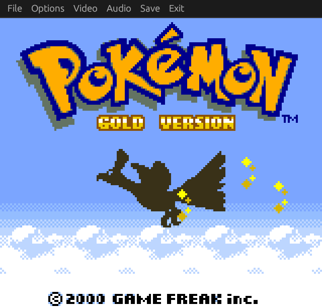

# Rugby
Rugby is a Game Boy and Game Boy Color emulator written in Rust. It supports most cartridges and has many features like customizable palettes and rewinding. It can be compiled to run in most architectures, including the web!

## Gallery
  
 
 
 

# Installation and usage:
### Build youself
- Clone the repository, go to the `rugby_desktop` directory and run:
```
cd rugby/rugby_desktop
cargo run --release [ROM.gb]
```
If you want to load a ROM file named [ROM] from start, you can can:
```
cd rugby/rugby_desktop
cargo run --release
```

You can enable the ```debug``` feature to print execution logs (useful when you want to compare against your emulator). By default the logs are printed to the standard input, so you can easily redirect them to a file like so:
```
cd rugby/rugby_desktop
cargo run --features debug [ROM] > log.txt
```

# Features
- Both Game Boy and Game Boy Color have been implemented.
- ROM Only, MBC1, MBC2, MBC3, and MBC5 cartridges are supported.
- Real-time clock (RTC) on supported cartridges.
- Full sound support, with the ability to enable/disable individual sound channels
- Pause/unpause whenever you want.
- Integer scaling from x1 to x5.
- Custom palettes.
- Enable/disable individual display layers.
- Multiple save states.
- Rewind for up to 5 seconds.
- And a simple UI to show all of the above!

# Controls
| Key | Action |
| ---| --- |
|`UP` |Up|
|`DOWN` |Down|
|`LEFT`|Left|
|`RIGHT`| Right|
|`A`| A|
|`S`| B|
|`Z`| Start|
|`X`| Select|
|`O`| Save state|
|`P`| Load state|
|`I`| Load last save state|
|`R`| Rewind
|`ESC` | Exit |

# Resources
### Documentation
- [The Ultimate Game Boy talk](https://www.youtube.com/watch?v=HyzD8pNlpwI&feature=youtu.be)
- [Pandocs](https://gbdev.io/pandocs/About.html): Comprehensive technical reference
- [GBEDG](https://hacktix.github.io/GBEDG/): Useful explanations on how the PPU works
- [gbops](https://izik1.github.io/gbops/index.html): Opcodes table
- [Explanation on the DAA instruction](https://ehaskins.com/2018-01-30%20Z80%20DAA/)

### Other great Game Boy emulators that helped me
- [BGB](https://bgb.bircd.org/), used mainly for debugging
- [Argentum](https://github.com/NightShade256/Argentum)
- [kevboy](https://github.com/xkevio/kevboy), especially for the parts regarding audio
- [Gameboy-Emulator](https://github.com/zach1590/gameboy-emulator)
- [rboy](https://github.com/mvdnes/rboy)

### The demo ROMs that I include in the web version:
- [Is that a Demo in Your Pocket](https://hh.gbdev.io/game/is-that-a-demo-in-your-pocket)
- [Back to Color](https://hh.gbdev.io/game/back-to-color)
- [Armageddon](https://hh.gbdev.io/game/armageddon)
- [Hi-Colour Demo](https://hh.gbdev.io/game/hi-colour-demo)

# License
Rugby is licensed under the [MIT license](https://choosealicense.com/licenses/mit/)
